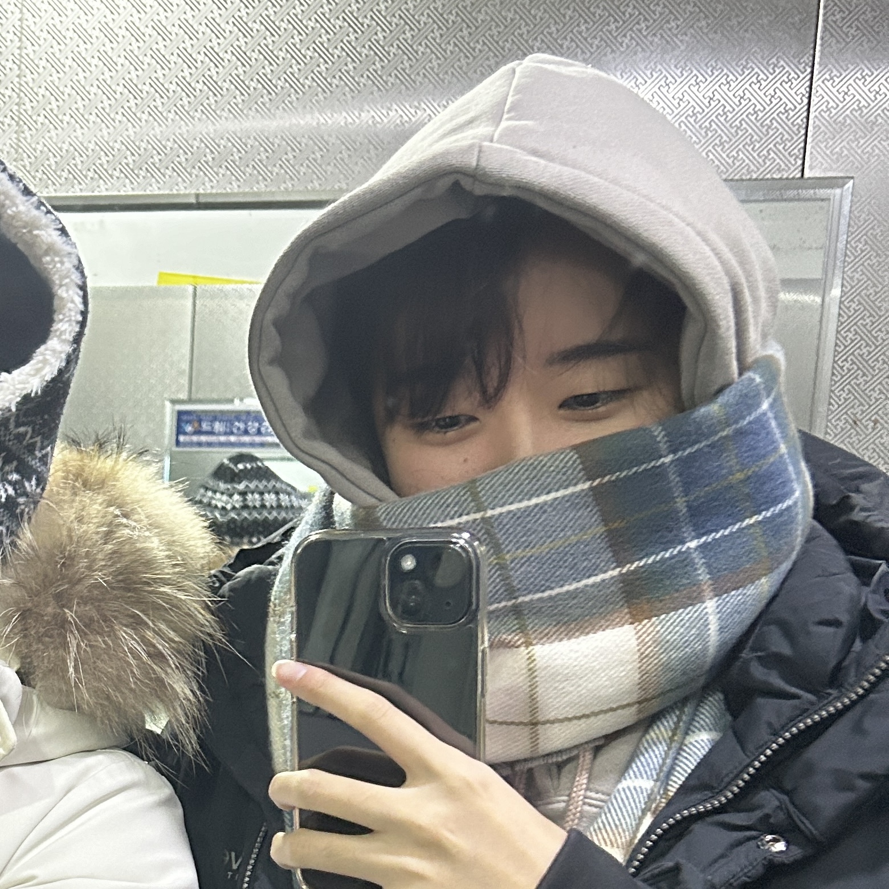

# TicTacToe

## Result 
### 📗 [Report (KR)](./img/report.pdf)  

### In the Real World
   
 

### Comment 
.

## Member
  

<table width="100%">
<tr><td align="center" width="33%" style="padding: 15px;">
           
        <b>이승연 (Seungyeon Lee)</b>  
        👑 팀장  AI • Robotics   
         
        
    </td>
    <td align="center" width="33%" style="padding: 15px;">
           
        <b>김현서 (Hyunseo Kim)</b>  
        팀원  Robotics   
         
        
    </td>
    <td align="center" width="33%" style="padding: 15px;">
           
        <b>안서연 (Seoyeon Ahn)</b>  
        팀원  AI • CV   
         
        
    </td>
    </tr><tr><td align="center" width="33%" style="padding: 15px;">
           
        <b>이채연 (Chaeyeon Lee)</b>  
        팀원  AI • CV   
         
        
    </td>
    <td align="center" width="33%" style="padding: 15px;">
           
        <b>이지민 (Jimin Lee)</b>  
        팀원  Robotics   
         
        
    </td>
    <td align="center" width="33%" style="padding: 15px;">
           
        <b>장예원 (Yewon Jang)</b>  
        팀원  AI   
         
        
    </td>
    </tr></table>