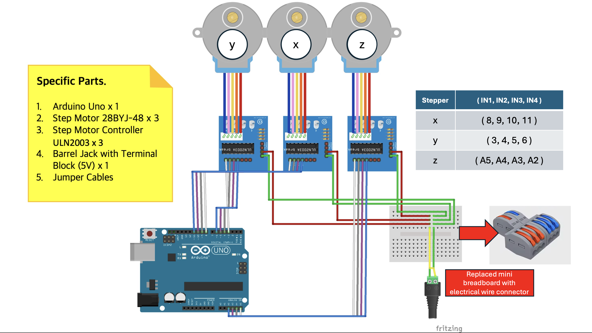
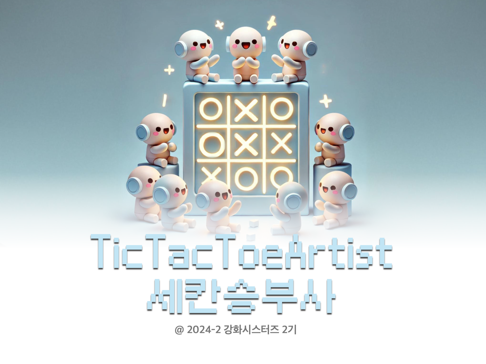

# TicTacToe
## About Code 
This research aims to develop a system that enables AI and humans to interact in the real world by controlling a CNC model. To achieve this, we implemented various methodologies, including AlphaZero, Monte Carlo Search (MCS), Monte Carlo Tree Search (MCTS), Min-Max, and Alpha-Beta pruning, to play Tic-Tac-Toe. In particular, we trained an optimal Tic-Tac-Toe neural network using a reinforcement learning model based on AlphaZero and compared its performance with traditional methods.

The game process was defined in five stages: image-based state recognition, reinforcement learning model prediction, robotic action execution, game state update, and turn iteration. This framework allowed AI to play the game in a real-world environment. Experimental results demonstrated that the AlphaZero-based AI achieved the highest win rate, outperforming other methods. This study validates the effectiveness of AlphaZero’s reinforcement learning techniques in a Tic-Tac-Toe environment and suggests the potential for expansion into various game and robotic control applications.

### File structure
```
📂
- cv         # Computer vision module for real-world interaction
- robotics   # Robotic arm control for physical gameplay
- environment  # TicTacToe Env-State  and test code
- model     # Trained final model
- final        # main file 
```
### Requirement 

- web cam : iPhone-Mac  
- Paper & Pen  
- [robot body](https://www.youtube.com/watch?v=og1506q67mo&list=LL&index=7)  
  

### Train info   
- takes 5 hours on Colab TPU 

### How to use
1. **train / test / interaction**  
- Modify `final/main.ipynb`  

## Result 
### 📗 [Report (KR)](./img/report.pdf)  

### In the Real World
   
 

### Comment 
In a standard Tic-Tac-Toe game, the second player is generally at a disadvantage. However, the AlphaZero-based AI implemented in this study demonstrated stable performance even when playing second. Notably, the AI incorporated search strategies to prevent losses, resulting in a lower probability of defeat when playing second. This study visually illustrates how AI selects moves based on search-based strategies, showcasing its superior adaptability compared to simple rule-based approaches.

## Member
  

<table width="100%">
<tr><td align="center" width="33%" style="padding: 15px;">
        <br><br> 
        <b>이승연 (Seungyeon Lee)</b> <br>
        <span style="color: gray; font-size:13px;">👑 팀장  AI • Robotics</span> <br><br>
        <a href="https://github.com/sabina381">
            
        </a> 
        <a href="mailto:sabina2378@ewhain.net">
            
        </a>
    </td>
    <td align="center" width="33%" style="padding: 15px;">
        <br><br> 
        <b>김현서 (Hyunseo Kim)</b> <br>
        <span style="color: gray; font-size:13px;">팀원  Robotics</span> <br><br>
        <a href="https://github.com/HyunseoKim812">
            
        </a> 
        <a href="mailto:rlagustj812@gmail.com">
            
        </a>
    </td>
    <td align="center" width="33%" style="padding: 15px;">
        <br><br> 
        <b>안서연 (Seoyeon Ahn)</b> <br>
        <span style="color: gray; font-size:13px;">팀원  AI • CV</span> <br><br>
        <a href="https://github.com/sy-mwish">
            
        </a> 
        <a href="mailto:aliceasy504@gmail.com">
            
        </a>
    </td>
    </tr><tr><td align="center" width="33%" style="padding: 15px;">
        <br><br> 
        <b>이채연 (Chaeyeon Lee)</b> <br>
        <span style="color: gray; font-size:13px;">팀원  AI • CV</span> <br><br>
        <a href="https://github.com/CheayeonLee">
            
        </a> 
        <a href="mailto:emilylcy0917@gmail.com">
            
        </a>
    </td>
    <td align="center" width="33%" style="padding: 15px;">
        <br><br> 
        <b>이지민 (Jimin Lee)</b> <br>
        <span style="color: gray; font-size:13px;">팀원  Robotics</span> <br><br>
        <a href="https://github.com/Tonnonssi">
            
        </a> 
        <a href="mailto:tonnonssi@gmail.com">
            
        </a>
    </td>
    <td align="center" width="33%" style="padding: 15px;">
        <br><br> 
        <b>장예원 (Yewon Jang)</b> <br>
        <span style="color: gray; font-size:13px;">팀원  AI</span> <br><br>
        <a href="https://github.com/grace0039">
            
        </a> 
        <a href="mailto:grace0039@naver.com">
            
        </a>
    </td>
    </tr></table>